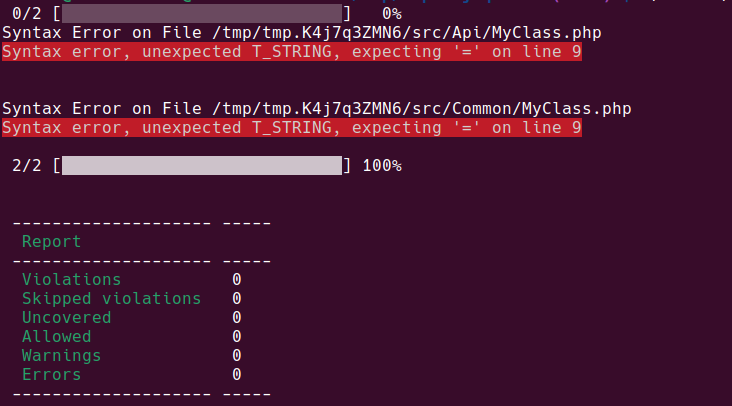

# deptrac-reproducer

This repo is a reproducer for deptrac issue: https://github.com/qossmic/deptrac/issues/1371

## How to reproduce

1. Run `composer install`
2. Run `./vendor/bin/deptrac`

## Result



## Expected


## dev-main

Using `dev-main` doesn't seem to work either (same result as above).

```bash
composer require --dev qossmic/deptrac-shim:dev-main
```
